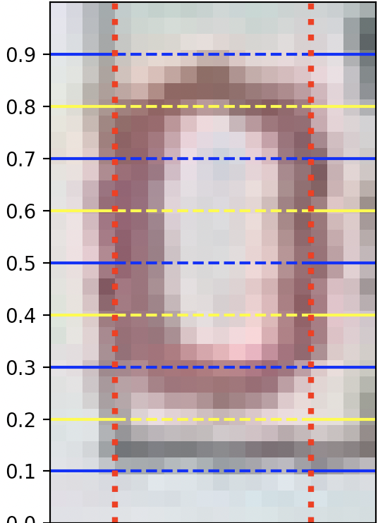
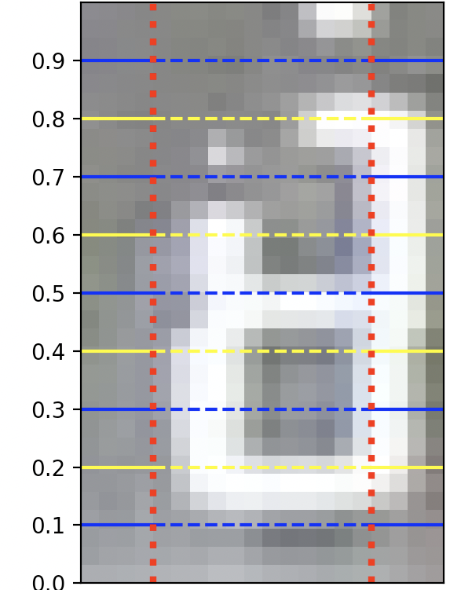
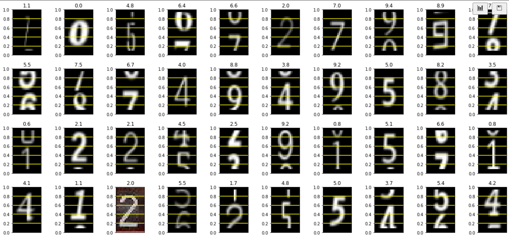

## Readout edge AI digits from meters

Help us to get more image data and improve your own digit meter predictions!

### Setup your watermeter device

Before you can read the images, you have to configure the logging of the digits in your device.

Go to you devices and open the configuration.

Now setup the *LogfileRetentionsInDays*. You have to select the checkbox if not already configured.

Please do not change the path of *LogImageLocation* ( /log/digit )

If you had to enable the image logging, you need wait a few days before you can readout all the images.

### Configure ROIs (regions of interest) correctly

Before you read out the images, have a look at

https://github.com/jomjol/AI-on-the-edge-device/wiki/ROI-Configuration . It is essential to get good images to learn the neuronal network.

**But the height should be based on the window edges, not on the digit.** 

### Read the images

This is mostly the easiest part, if you have installed python on your computer. If not you need to install it ( https://www.python.org/downloads/ ).

Open a terminal and type in:

    pip install git+https://github.com/haverland/collectmeterdigits

    python3 -m collectmeterdigits --collect=<your-esp32name> --days=3

It downloads now all images in a "data" subfolder. The image names will be hashed for your privacy. 
Be patiant. It will takes a while.

After it the duplicates will be automaticly removed and finally you have a folder named data/labled with the images.

### Label the images

Now you can label the images. After reading the images it opens a window.

You can see the digit and have to readjust the label. If it is correctly, you can click on
update. If not use the slider to adjust it.

The yellow and blue lines helps you. Look at the gap between the digits. At left scale you read the value. Don't worry, it must not 100% right. And sometimes it's not easy to choose the value.

The digit should be between the red dotted lines.

If you digits are a bit smaller, look at the digit shift. Here it is not 0.2. If you imagine where the digit is at zero, the shift is only 0.05. So 0.1 or 0.0 would be the correct label.

If the image is not usable to identify the digit, click on delete.

After all images are labeled, the window closes automaticly.

If you're unsure, here you can see examples.

### More Options

If you only want label images you can type:

    python3 -m collectmeterdigits --labeling=\<path_to_your_images\>

or if you want remove similar images. The images must be stored in ./data/raw_images

    python3 -m collectmeterdigits --collect=<ip or servername> --nodownload

You can keep the downloaded images with option --keepdownloads

    python3 -m collectmeterdigits --collect=<ip or servername> --keepdownloads

If the labeling takes to long, you can later restart at a given digit

    python3 -m collectmeterdigits --collect=<ip or servername> --nodownload --startlabel <number>

### Ready to share

After labeling you find the images under **"./data/labeled"**. 

Zip the folder. If it is smaller than 2MB you can mail it to iotson(at)t-online.de. Else please contact us, to find a other way.

### Comming Next

*  pre-prediction via tflite

